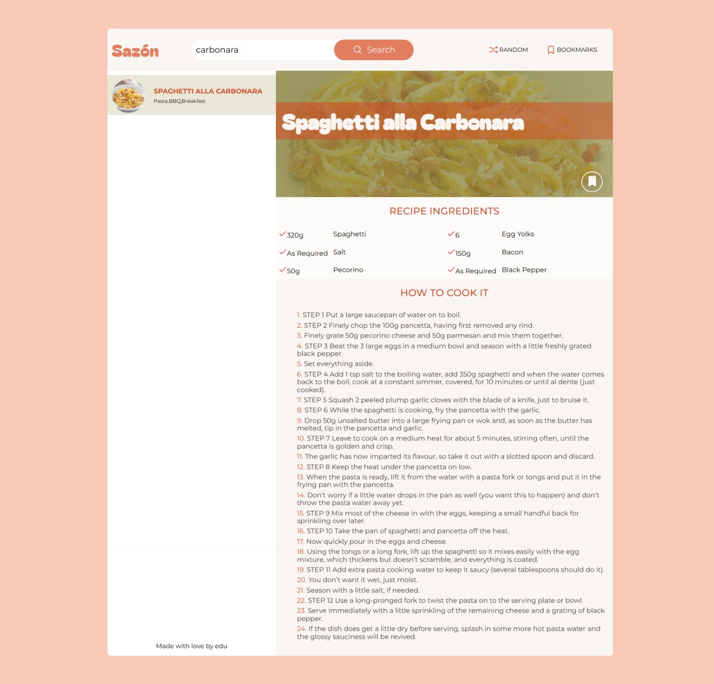

# Sazón Cooking Diary 🍲

<div align="center">
<!--    -->
  # 𝕊𝕒𝕫ó𝕟 ℂ𝕠𝕠𝕜𝕚𝕟𝕘 𝔻𝕚𝕒𝕣𝕪 🍲
  
  [](https://opensource.org/licenses/MIT)
  
  

</div>

A personal cooking assistant that helps you discover, save, and organize recipes from around the world - created by a programmer who's also a cooking student!

## Features ✨

- **Random Recipe Generator** - Get inspired with random meals from [TheMealDB](https://www.themealdb.com/) API
- **Smart Search** - Find recipes by name or ingredients
- **Bookmark System** - Save your favorite recipes to localStorage
- **Recipe Details** - Complete ingredients lists and step-by-step instructions

## Tech Stack 🛠️

- **Frontend**: React 18 + TypeScript
- **Styling**: Pure CSS (no frameworks)
- **State Management**: React Context API
- **API**: [TheMealDB](https://www.themealdb.com/)
- **Build Tool**: Vite

## Installation 💻

```bash
# Clone the repository
git clone https://github.com/yourusername/sazon-cooking-diary.git

# Navigate to project directory
cd sazon-cooking-diary

# Install dependencies
npm install

# Run development server
npm run dev

src/
├── views/           # Reusable UI components
├── context/         # React context providers
├── models/          # TypeScript interfaces
├── assets/          # Images & icons
├── App.tsx          # Main application
└── main.tsx         # Entry point
```

## Why "Sazón"? 🌶️
As a Venezuelan cooking student and programmer, I wanted to:
- Pay homage to our culinary concept of "sazón" - that special touch that makes food delicious
- Create a tool that helps me organize recipes from my cooking classes

### Combine my two passions: coding and cuisine

## Future Enhancements 🚀
- User authentication
- Meal planning calendar
- Shopping list generator
- Cooking timer integration
- Recipe sharing feature

## Screenshots 🖼️


## Live Demo 🌐
[Try Sazón Cooking Diary Online](https://sazon-cooking-diary.netlify.app/)
